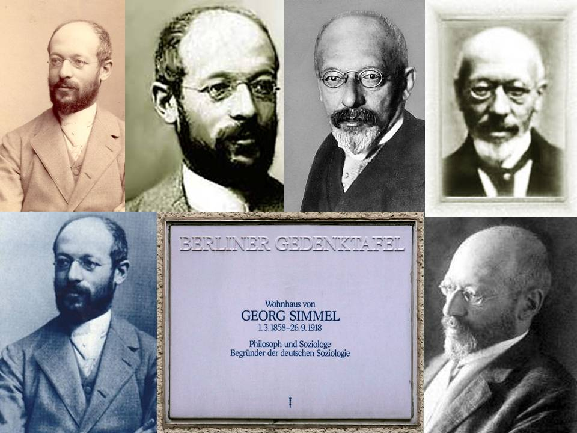

layout: true

```{r setup, include=FALSE}
options(htmltools.dir.version = FALSE)

knitr::opts_chunk$set(
	echo = FALSE,
	fig.align = "center",
	message = FALSE,
	warning = FALSE,
	cache = FALSE
)
```

```{r eval=FALSE, include=FALSE}
library(knitr)
library(tidyverse)
```

---
class: middle, center  

# Apresentações!😃 🙋️

---
class: middle, center  

# Leonardo F. Nascimento

```{r out.width="25%"}
knitr::include_graphics("img/logos_bia.png")
```

## 15% Programador, 20% Químico, 25% Psicólogo, 40% Cientista Social
<br>

### [Email: **leofn3@gmail.com**](mailto:leofn3@gmail.com) 

### [Twitter:**@leofn3**](http://www.twitter.com/leofn3) 

### [website: **www.leofn.com**](http://www.leofn.com)

---
class: middle, center  

```{r, out.width="50%"}
knitr::include_graphics("img/labhd.png")
```

## Laboratório de Humanidades Digitais da UFBA

**Twitter**: [@labhdufba](https://twitter.com/labhdufba) 
<br>
**Instagram**: [@labhdufba](http://instagram.com/labhdufba)
<br>
**Github**: [https://github.com/LABHDUFBA](https://github.com/LABHDUFBA)
<br>
**Youtube**: [https://www.youtube.com/c/LABHDUFBA](https://www.youtube.com/c/LABHDUFBA)

---
class: inverse, center, middle

# Objetivo da aula

---
class: center, middle

## Apresentar as principais ideias do texto "As grandes cidades e a vida do espírito" (Simmel, 1903) e discutir como elas podem ser úteis para a compreensão da vida social contemporânea.


---
class: inverse, center, middle

# Foi difícil a leitura?? 
# 🤔😱🤔😱


---
class: center, middle

## Vamos começar com um desenho animado? 
<br>

<iframe width="600" height="350" src="https://www.youtube.com/embed/SgbPfY3Pqzs" frameborder="0" allow="accelerometer; autoplay; encrypted-media; gyroscope; picture-in-picture" allowfullscreen></iframe>


---
class: middle, center

# Quem foi Georg Simmel(1858-1918)?

```{r, out.width="100%"}



```

---
class: inverse, middle, center

# Qual a ideia central do texto?
# 📔📕📖📗📘📙📚

---
class: center, middle

--
## 1) análise das transformações psicológicas e sociais provocadas pela vida nas grandes cidades modernas;
<br>

--
## 2) o contraste entre a vida nas cidades grandes e pequenas;
<br>

--
## 3) como a economia monetária (e o dinheiro! 🤑👛🏦💰💴) promovem uma visão mais objetiva e despersonalizada das relações humanas. 

---
class: center, middle

# O que são "grande cidades" (*Grossstädte*) em 1908? 
<br>

--
## 1) + de 100 mil habitantes. 
<br>

--
## 2) De 1871 a 1910 na Alemanha o número dessas cidades passou de oito para quarenta e oito (Gay, 1989a, p.45)

---
class: inverse, middle, center

## Aumento quantitativo e mudanças qualitativas!

```{r, out.width="100%"}
knitr::include_graphics("https://media.giphy.com/media/Dumy6VxTrZfS8/giphy.gif")
```

---
class: middle, center

--
## Ocorre não apenas uma mudança física (construções, estradas, meios de transporte, interior das residências).
<br>

--
## Tudo isto representa um precipitado, uma cristalização *in vivo*, da forma como as relações sociais se modificaram nos "centros urbanos"...
<br>

---
class: inverse, center, middle

# Intensificação da vida nervosa 
# 😥😟😧😨😰💗

```{r, out.width="90%"}

knitr::include_graphics("https://media.giphy.com/media/pDdzX4l9jqA80/giphy.gif")

```

---
class: center, middle

--
# "Eu quero uma casa no campo..." 
<br>

--
## - caráter intelectualista da vida anímica do habitante da cidade grande;
<br>

--
## - habitante da cidade pequena: caráter baseado no ânimo e nas relações pautadas pelo sentimento;
<br>

--
## - caráter blasé, a reserva, indiferença e a antipatia...


---
class: inverse, center, middle

# Economia monetária e a vida social

```{r, out.width="90%"}

knitr::include_graphics("https://media.giphy.com/media/67ThRZlYBvibtdF9JH/giphy.gif")

```

---
class: center, middle

--
# "Qual o seu preço? pois todo mundo tem um preço..." 
<br>

--
## "os egoísmos econômicos x imponderáveis das relações pessoais";
<br>

--
## O anonimato e a impessoalidade da cidade grande tem raízes profundas com a economia monetária;
<br>

--
## "Mediante a essência contábil do dinheiro chegou-se (...)a uma precisão, a uma segurança na determinação de igualdades e desigualdades, a uma univocidade nos acordos e combinações"

---
class: center, middle

--
# "Time is money..." 
<br>

--
## "a grandeza das distâncias, que torna toda espera e viagem perdida, uma perda de tempo insuportável";
<br>

--
## Pontualidade, a contabilidade, a exatidão: aspectos externos e internos;
<br>

--
## o caráter intelectualístico e econômico-monetário buscam excluir os impulsos irracionais, instintivos e soberanos.

---
class: center, middle

--
# "Nivelar coisas e pessoas..." 
<br>

--
## "compressão de homens e coisas";
<br>

--
## evitação da vizinhança;
<br>

--
## a antipatia como proteção.

---
class: inverse, center, middle

## A indiferença é uma forma de socialização

```{r, out.width="90%"}

knitr::include_graphics("https://media.giphy.com/media/sIoYmnRIbFkt2/giphy.gif")

```

---
class: center, middle

--
# "Ah, look at all the lonely people!" 
<br>

--
## "a proximidade corporal tornam verdadeiramente explícita a distância espiritual";
<br>

--
## "em nenhum lugar alguém se sente tão solitário e abandonado como precisamente na multidão da cidade grande";
<br>

--
## quem sou eu? quem é você? quem somos nós?

---
class: center, middle

--
# "Grandes Cidades e cosmopolitismo" 
<br>

--
## "uma cidade constitui-se da totalidade de seus efeitos, que ultrapassam o seu imediatismo";
<br>

--
## "Pressão por diferença e especialização";
<br>

--
## "Lutar com palavras é a luta mais vã. Entanto lutamos mal rompe a manhã" (Carlos Drummond de Andrade)

---
class: center, middle

--
# "Chamei de mau gosto o que vi, de mau gosto, mau gosto..." 
<br>

--
## 
<br>

--
## 
<br>

--
## 


---
class: middle, center

# Dúvidas? Perguntas?

---
class: middle, center

# Obrigado gente!

.pull-left[
```{r, out.width="150%"}
knitr::include_graphics("https://media.giphy.com/media/3oz8xIsloV7zOmt81G/giphy.gif")
```
]
.pull-right[
#### **Agradecimentos especiais**: 

- Professora Luciana Duccini pelo convite!

]

---
class: middle, center

## Referências bilbiográficas


